# ✨ Phân Tích Sắc Thái Cảm Xúc Bình Luận Trên Sàn Thương Mại Điện Tử ✨

## 💡 Giới Thiệu Chung
🌍 Trong bối cảnh phát triển mạnh mẽ của các sàn thương mại điện tử, các bình luận từ người tiêu dùng trở thành nguồn thông tin quan trọng giúp người mua đồ phân tích sản phẩm và nhà bán hàng cải thiện dịch vụ. 

🎯 Dự án này nhằm mục tiêu giúp phân tích nhanh các bình luận và tìm hiểu xem nhận định của người dùng là tích cực hay tiêu cực từ đó đưa ra được nhận xét tổng thể là sản phẩm có nên mua hay là không!

🧠 **Sentiment Analysis** là một kỹ thuật trong xử lý ngôn ngữ tự nhiên **(NLP)** dùng để xác định và phân loại cảm xúc (tích cực, tiêu cực) của văn bản. Đề tài này tập trung xây dựng một hệ thống phân tích cảm xúc hiệu quả, áp dụng mô hình **PhoBERT** kết hợp với **CNN** và **BiLSTM** để khai thác tối ưu đặc trưng ngữ nghĩa và ngữ cảnh trong bình luận tiếng Việt. Ngoài ra còn triển khai mô hình **ELECTRA-BASE** nhằm đánh giá xem mô hình trên được huấn luyện trên Embedding của PhoBert đã tới hạn với tập dữ liệu hay chưa, triển khai mô hình ELECTRA-Base loại bỏ hoàn toàn các lớp tùy chỉnh (CNN, BiLSTM, Attention) và dựa vào kiến trúc transformer của Electra để xem độ chính xác có được cải thiện hay không, khám phá khả năng của ELECTRA trong xử lý ngôn ngữ tiếng Việt. Nghiên cứu hứa hẹn mang lại giá trị ứng dụng cao và đóng góp vào việc xử lý ngôn ngữ tự nhiên cho tiếng Việt.

---

## 🛠️ Chức năng chính
- 🔍 **Phân tích cảm xúc sắc thái**: Nhận đầu vào là văn bản, trả về nhãn là sắc thái tích cực hoặc tiêu cực kèm theo tỉ lệ nhằm đánh giá mức độ của sắc thái.
- 📦 **Phân tích sản phẩm**: Nhận đầu vào là đường link liên kết đến sản phẩm trên sàn thương mại điện tử, trả về nhận xét tổng quan và bảng phân tích chi tiết về sản phẩm.
- 📊 **Giao diện trực quan**: Biểu đồ pie chart và bảng phân tích.

---

## 🎥 Demo

- 🎞️ Xem DEMO đầy đủ tại đây: [Sentiment Comment DEMO](https://www.youtube.com/watch?v=8SF3TNwdB6w&t=371s)
  
---

## 🗺️ Tổng quan hệ thống

 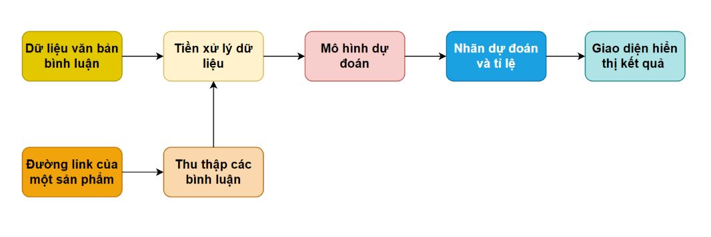
 
 ---
## 🔄 Quy trình tổng quan
 
 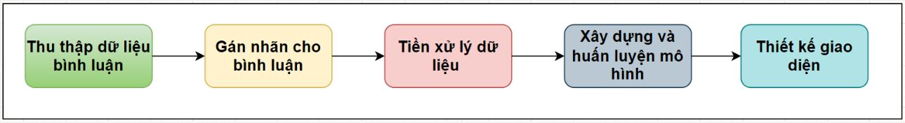
 
---

## 📂 Nguồn dữ liệu
- 🗃️ **Dữ liệu**: Thu thập từ các bình luận của sản phẩm từ các sàn thương mại điện tử như: Shopee, Lazada, Tiki, Sendo,...
- 📝 **Cấu trúc dữ liệu**: Bao gồm  nội dung của bình luận, nhãn (Tích cực/Tiêu cực).

---

## 🔄 Quá trình thu thập và xử lý dữ liêu

**1. 🕸️ Thu thập dữ liệu:**
   - Sử dụng các thư viện như Selenium, BeautifulSoup, Requests,.. để thu thập dữ liệu là các bài báo từ nguồn dữ liệu theo cấu trúc dữ liệu.
   - Gán nhãn cho dữ liệu: Sau bước thu thập dữ liệu bình luận là gán nhãn (tích cực: 0 , tiêu cực: 1) cho các bình luận dựa theo tiêu chí:
      * Để đánh giá một nhãn của bình luận thì trước hết phải ưu tiên đến chất lượng của sản phẩm, ví dụ:
         
            + 😊 Sản phẩm rất đẹp, giao hàng nhanh - Nhãn tích cực: 0
            + 😠 Sản phẩm kém chất lượng, giao hàng nhanh - Nhãn tiêu cực: 1
      * Các bình luận trung lập thì phải dựa vào mức độ đánh giá giá sản phẩm để gán nhãn,ví dụ: 
        
            + 🙂 Sản phẩm tốt, giao hàng hơi chậm - Nhãn tích cực: 0
            + 😞 Sản phẩm tốt, giao hàng chậm, đóng gói sản phẩm kém - Nhãn tiêu cực: 1
   - Tham khảo code ở thư mục [Crawl](./DATA/Crawl)
     
**2. 🧼 Tiền xử lý:**
   - Chuẩn hóa văn bản (chuyển chữ thường, xóa ký tự đặc biệt).
   - Tách từ tiếng Việt (word_segmentation): [`NlpHUST/vi-word-segmentation`](https://huggingface.co/NlpHUST/vi-word-segmentation)
   - Loại bỏ stopwords và cân bằng dữ liệu.
   <br>  
   <div align="center">
      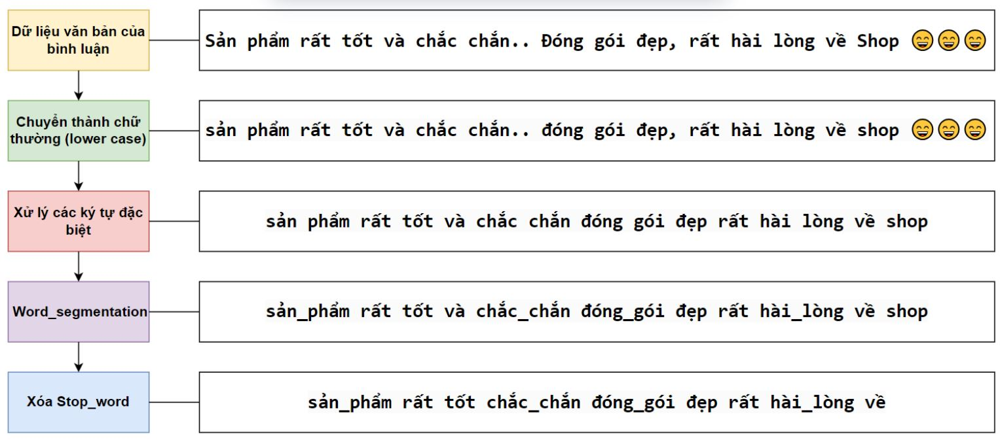
    </div>
   
**3. 📈 Thống kê dữ liệu:**
   
   | Loại bình luận | Số lượng | Tỷ lệ |
   |----------------|----------|-------|
   | 😊 Tích cực   | 17,312   | 50.2% |
   | 😠 Tiêu cực   | 17,156   | 49.8% |

**4. 📂 Phân chia tập dữ liệu huấn luyện:**
   - 🚂 **Train**: 70% (24.127 mẫu)
   - 🧪 **Validation**: 15% (5.170 mẫu)
   - 🧪 **Test**: 15% (5.171 mẫu)

---

# 🧠 Mô hình và Phương Pháp

## 1. 🤖 Mô hình PhoBERT kết hợp CNN và BiLSTM
  <div align="center">
  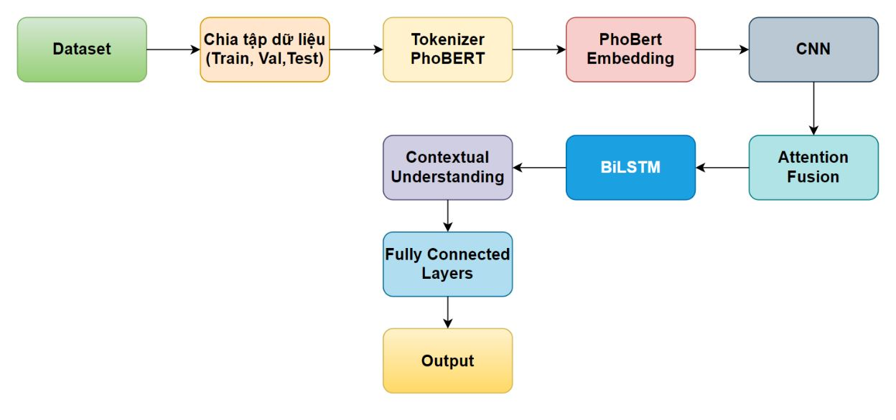
  </div>

### **a. Lý do sử dụng PhoBERT**
- 🔡 **Tokenizer và Embedding của PhoBERT**: PhoBERT là mô hình được huấn luyện đặc biệt trên dữ liệu tiếng Việt, sử dụng phương pháp **Byte Pair Encoding (BPE)** để xử lý văn bản tiếng Việt hiệu quả. Tokenizer của PhoBERT phân chia từ thành các token phù hợp với cấu trúc ngữ pháp tiếng Việt, đồng thời khớp hoàn hảo với embedding của PhoBERT.
   
  <div align="center">
  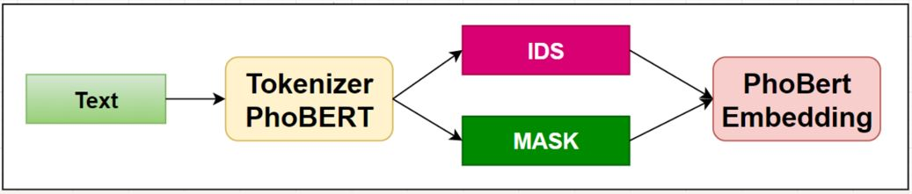
  </div>
- 📊 **Embedding giàu ngữ nghĩa và ngữ cảnh**: 
  - Biểu diễn từng từ dưới dạng vector 1024 chiều (với PhoBERT-large).
  - Nắm bắt ý nghĩa của từ và ngữ cảnh trong câu. Ví dụ: Từ "lực" trong "lực lượng" và "hút lực" sẽ có embedding khác nhau.
  <p align="center">
  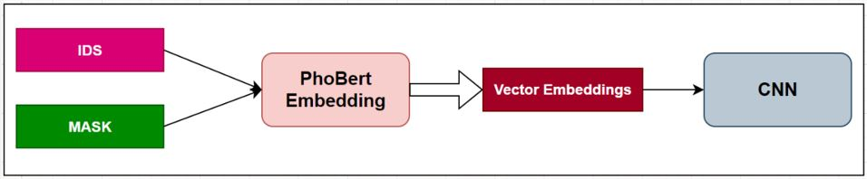
  </p>
- 🏆 **Ưu điểm của PhoBERT**: 
  - Xử lý tốt các từ ghép, từ đồng âm, từ viết tắt, viết sai chính tả.
  - Hiểu ngữ cảnh động và xử lý ngữ cảnh của từng từ trong câu, phù hợp với tiếng Việt phức tạp.

### **b. Kiến trúc mô hình**
- 🕸️ **CNN (Convolutional Neural Network)**: Trích xuất đặc trưng cục bộ từ embedding của PhoBERT (2 lớp CNN).
  
  <div align="center">
  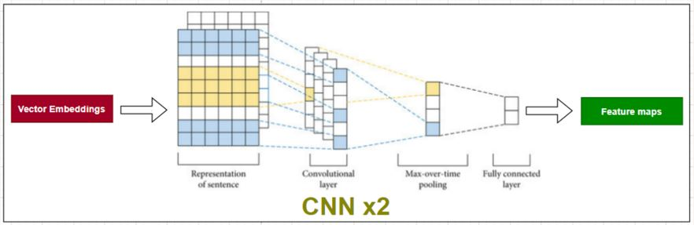
  </div>
  
  <div align="center">
  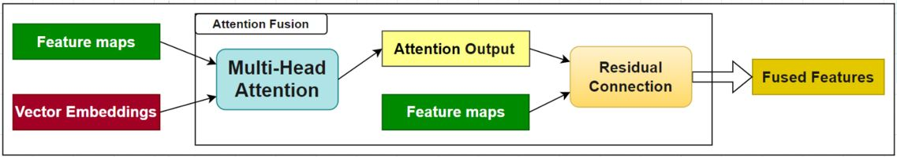
  </div>
  
- 🔄 **BiLSTM (Bidirectional LSTM)**: Nắm bắt ngữ cảnh dài hạn từ cả hai chiều của chuỗi văn bản.
  
  <div align="center">
  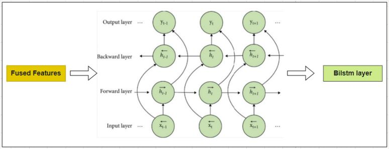
  </div>

  <div align="center">
  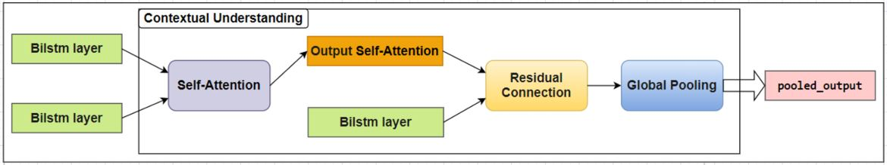
  </div>
  
- 🧩 **Fully Connected Layers**: Kết hợp các đặc trưng từ CNN và BiLSTM để đưa ra dự đoán cuối cùng.

  <div align="center">
  
  </div>
  
### c. Kết quả trên tập Test
- 🎯 **Accuracy**: 95.13%
- 🔄 **Recall**: 95.13%
- 📉 **F1-score**: 95.13%
- 😊 **Positive**: 95.07%
- 😠 **Negative**: 95.17%
  <div align="left">
  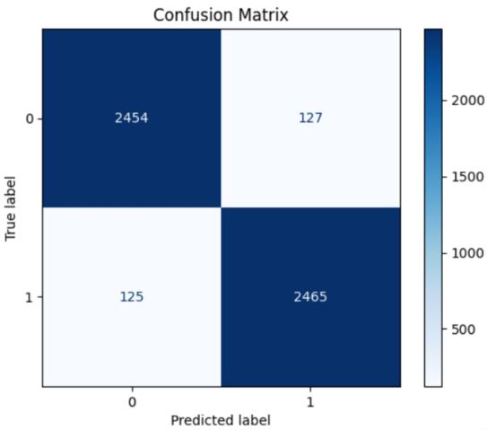
  </div>

---

## 2. ⚡ Mô hình ELECTRA-BASE

### a. Lý do sử dụng ELECTRA
- 🎯 **Cơ chế Replaced Token Detection**: ELECTRA sử dụng cơ chế phát hiện token thay thế, giúp học biểu diễn hiệu quả hơn so với các phương pháp truyền thống như Masked Language Model (MLM) của BERT.
- 🏗️ **Kiến trúc Transformer**: Loại bỏ các lớp tùy chỉnh (CNN, BiLSTM, Attention) và dựa hoàn toàn vào kiến trúc Transformer của ELECTRA để đánh giá hiệu suất.
<br>
<div align="center">
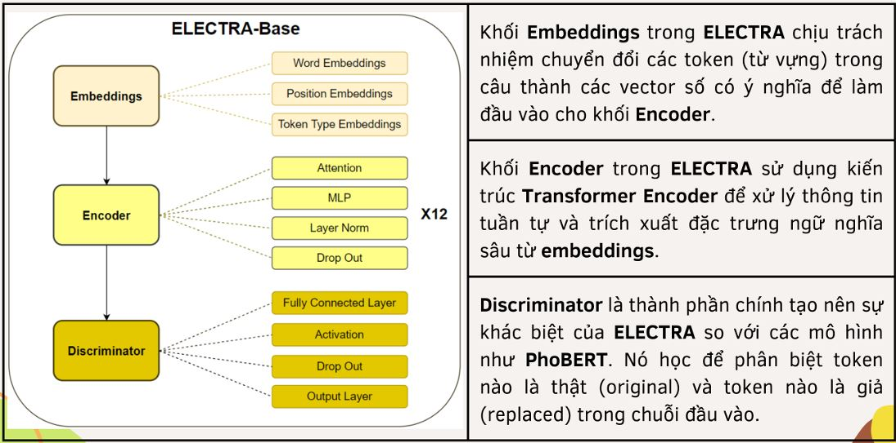
</div>
  
### b. Quy trình huấn luyện

<div align="center">
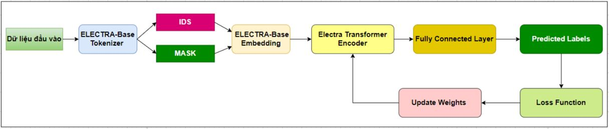
</div>

### c. Kết quả trên tập Test
- 🎯 **Accuracy**: 96.65%
- 🔄 **Recall**: 96.65%
- 📉 **F1-score**: 96.65%
- 😊 **Positive**: 96.51%
- 😠 **Negative**: 96.79%

<div align="left">
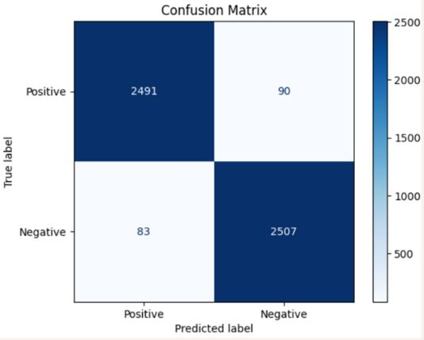
</div>

---

## 3. ⚖️ So sánh hai mô hình

| Mô hình       | Accuracy | Recall | F1-score | Positive | Negative |
|---------------|----------|--------|----------|----------|----------|
| **CNN-BiLSTM** | 95.13%   | 95.13% | 95.13%   | 95.07%   | 95.17%   |
| **ELECTRA**    | 96.65%   | 96.65% | 96.65%   | 96.51%   | 96.79%   |

<div align="center">
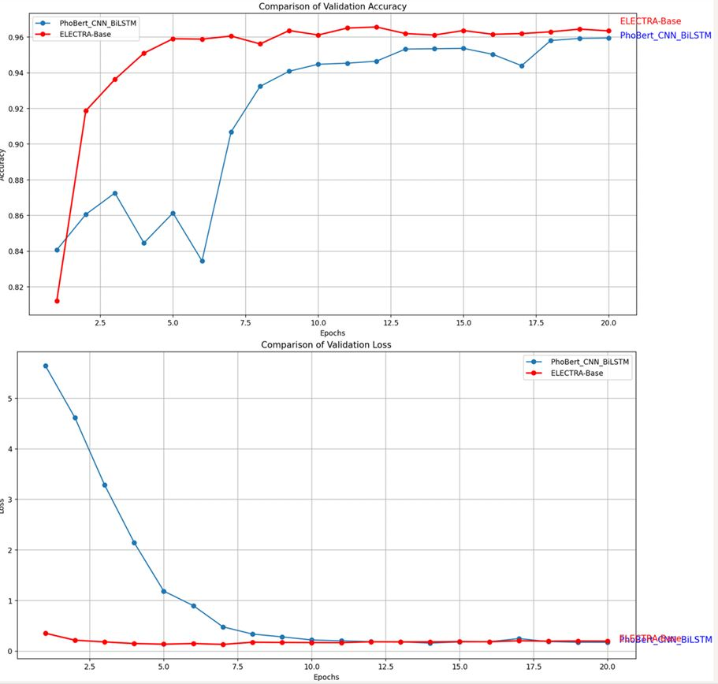
</div>
---

## 4. 🚧 Thách thức và khó khăn

### a. Thách thức liên quan đến dữ liệu
- 🔠 **Ngôn ngữ không dấu**: Tiếng Việt có thể viết có dấu hoặc không dấu, gây khó khăn cho mô hình trong việc phân biệt nghĩa. Ví dụ: "tốt" và "tot", "kém" và "kem".
- 🆖 **Từ viết tắt và từ lóng**: Nhiều từ viết tắt hoặc tiếng lóng trên mạng xã hội. Ví dụ: "phim này ko hay", "ủa z là sao".
- 🧹 **Chất lượng dữ liệu**: Dữ liệu có thể chứa lỗi chính tả, ngôn ngữ không chuẩn mực hoặc cú pháp không đầy đủ.

### b. Thách thức trong mô hình CNN-BiLSTM
- 📏 **Xử lý chuỗi dài**: Tiếng Việt có câu dài và từ phức tạp, gây khó khăn cho BiLSTM trong việc nắm bắt toàn bộ thông tin.
- 🧠 **Kích thước embedding**: Tìm embedding phù hợp cho tiếng Việt (Word2Vec, FastText, BERT) là một thách thức lớn.

---

## 📌 Kết luận
- 🏆 **PhoBERT + CNN + BiLSTM** và **ELECTRA** đều cho kết quả tốt, với ELECTRA vượt trội hơn về độ chính xác.
- 🚩 Các thách thức về dữ liệu và ngôn ngữ tiếng Việt cần được giải quyết để cải thiện hiệu suất mô hình.

---

## 🚀 Hướng phát triển
- 📈 **Mở rộng dữ liệu**: Thu thập thêm dữ liệu từ nhiều nguồn để đa dạng hóa ngữ cảnh và sắc thái cảm xúc. 
- 🌐 **Ứng dụng thực tế**: Triển khai API hoặc tích hợp vào các sàn thương mại điện tử. Phát triển ứng dụng di động để phân tích cảm xúc nhanh chóng.
- 🔬 **Nghiên cứu sâu hơn**: Phân tích ngữ cảnh đa chiều và xử lý câu phức tạp. Cải thiện khả năng hiểu ngữ cảnh văn hóa và xã hội.
- 💡 **Tính năng mới**: Phân tích xu hướng cảm xúc theo thời gian. Gợi ý cải thiện sản phẩm dựa trên phản hồi khách hàng.

---

## 🛠️ Cài đặt
### 📥 Tải code:
```bash
cd sentiment_comment
git clone https://github.com/tttiuem2k3/Sentiment_Comment.git
pip install -r requirements.txt
```
### 🏋️ Huấn luyện mô hình:
- Huấn luyện mô hình dựa trên bộ data: [`COMMENT_DATA`](./DATA)
- Tham khoản code huấn luyện mô hình: [`CODE`](./CODE)
### 🚀 Chạy ứng dụng:
Run python [`App.py`](./APP/app.py)

---

##  📞 Liên hệ
- 📧 Email: tttiuem2k3@gmail.com
- 👥 Linkedin: [Thịnh Trần](https://www.linkedin.com/in/thinh-tran-04122k3/)
- 💬 Zalo: +84 329966939

